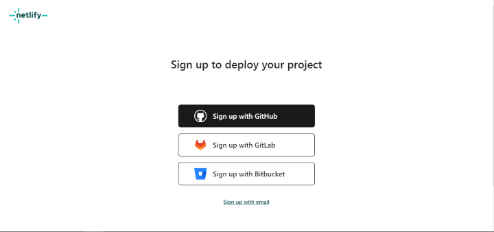
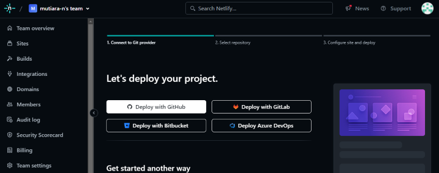
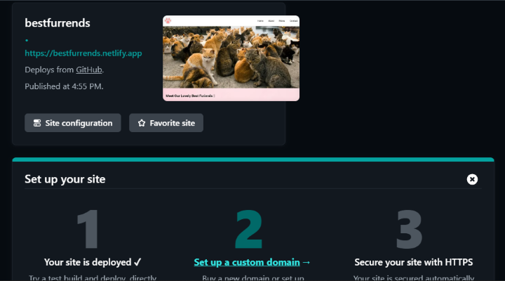
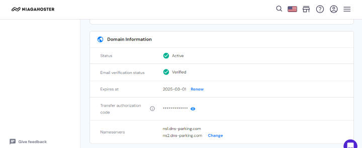
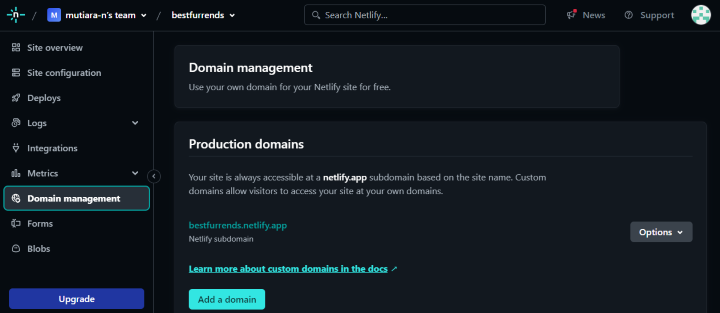
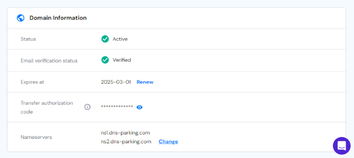

# deploy-project
Contoh deploy netlify

# Best Furiends Furever
This is a simple animal shelter for cat adoption website.

## About Project
This website consist of three sections. In the first section, there's a preview of some cats that are ready for adoption. The second section has an "About Us" page which will be filled with short information about the animal shelter. The last section contains a "Contact Us" for user who might be interest in adopting a cat or two from the website.

## Website Preview

## Deployment Process
1. Daftarkan akun netlify menggunakan github serta emberi izin bagi netlify untuk mengakses akun github.

2. Setelah akun netlify berhasil dibuat, kita akan membuat situs berdasarkan project yang sudah ada. Dikarenakan netlify sudah terhubung dengan akun github, repositori yang sudah ada dapat digunakan dalam pembuatan situs.

3. Pilih salah satu repositori yang akan di deploy, lalu isi site name serta pilih branch mana yang akan di deploy.

4. Tunggu beberapa saat sampai situs selesai di deploy dan menampilkan halaman berikut.

5. Setelah situs selesai di deploy, langkah selanjutnya adalah melakukan set up untuk custom domain. Domain yang digunakan untuk project ini adalah Niagahoster. Pertama-tama, cari nama domain yang diinginkan dan pilih paket domain yang diinginkan.\

6. Pilih durasi paket yang dibutuhkan, kemudian pilih metode pembayaran paket domain.

7. Jika pembayaran telah selesai dilakukan, niagahoster akan menunjukkan bukti bahwa pembayaran telah berhasil.

8. Lakukan registrasi domain dengan mengisi data diri, maka registrasi domain selesai dilakukan dan set up custom domain dapat dimulai.

9. Pilih menu Domain Management pada situs Netlify yang telah di deploy, kemudian pilih Add Domain.

10. Tambahkan custom domain sesuai dengan domain yang telah didaftarkan.

11. Dapat dilihat dari gambar sebelumnya, situs belum bisa berjalan tanpa DNS. Setup DNS dapat dilakukan di niagahoster dengan mengganti <b>nameservers</b> di halaman domain overview dengan nameservers Netlify.

12. Tunggu maksimal 24 jam sampai tanda Awaiting External DNS berubah menjadi Netlify DNS, maka proses penambahan custom domain selesai dilakukan.\

